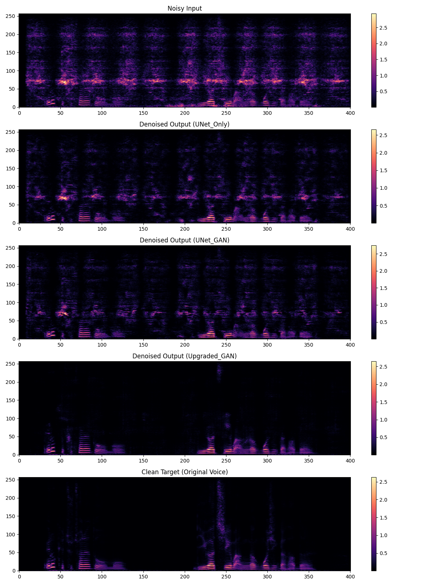
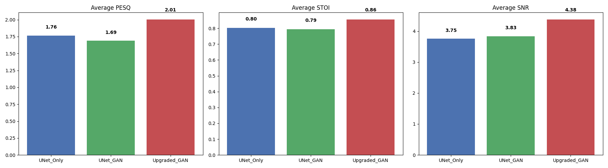

# UNet 모델을 통한 소음 제거(Denoising) 모델 개발 및 성능 검증

## 1. 진행 배경 및 목적
배경 소음이 섞인 음성 데이터에서 순수 목소리만 분리해내는 음성 강화(Speech Enhancement) 모델을 구축하는 것을 목적으로 하며, 주로 U-Net과 GAN을 활용하였다.  
테스트 과정에서는 구조 변경에 따른 모델의 코드가 포함되어 있으며, 이들의 성능 변화를 수치적, 시각적으로 비교 분석하였다.

## 2. 디렉토리 구조
```text
📦 Repository
├── 📂 src/                        # 공통 Python 모듈 (모델 · 학습 · 데이터 · 평가)
│   ├── models.py                       # UNetMasker / Discriminator / UpgradedUNet / UpgradedDiscriminator
│   ├── audio_utils.py                  # get_spec, spec_to_wav, Overlap-Add, AGC
│   ├── dataset.py                      # RobustDataset, 압축 해제 관리
│   ├── metrics.py                      # PESQ / STOI / SNR 계산, 테스트 샘플 로드
│   └── trainer.py                      # train_unet / train_unet_gan / train_upgraded_gan, 체크포인트 관리
│
├── main.ipynb                     # 메인 노트북: 학습 → 검증 → 3모델 비교 실행
├── app.py                         # Flask 웹 서비스 (RunPod 배포용)
│
├── 📂 archieve_notebooks/         # 리팩토링 이전 버전 노트북 (참고용 보존)
│   ├── UNet_test.ipynb
│   ├── UNet_GAN_test.ipynb
│   ├── UNet_GAN_Upgraded_test.ipynb
│   └── UNet_Verification.ipynb
│
├── 📂 server_test/                # Colab 내부 Flask 서버 테스트
│   └── UNet_Gan_Server_test.ipynb
├── 📂 data_processing/            # 노이즈 데이터 전처리
│   └── UNet_Noise_Data.ipynb
└── 📂 test_results/               # 검증 샘플(N=1~10) 결과물
    ├── 📂 audio/                       # 오디오 결과물 (.wav)
    └── 📂 figures/                     # 시각화 및 그래프 파일 (.png)
```

## 3. 실행 방법

### VSCode + Colab 확장 (학습 · 검증)
`main.ipynb`를 열고 셀을 순서대로 실행합니다.

| 셀 | 내용 |
|----|------|
| 1. 환경 설정 | Google Drive 마운트, GitHub에서 최신 `src/` 코드 clone |
| 2. 경로 및 설정 | `MODEL_VERSION` 선택 (`'unet'` / `'unet_gan'` / `'upgraded_gan'`), 하이퍼파라미터 |
| 3. 학습 실행 | 체크포인트가 있으면 자동으로 이어서 학습 |
| 4. 단일 모델 검증 | 랜덤 10샘플 스펙트로그램 · 오디오 저장 |
| 5. 3모델 성능 비교 | PESQ / STOI / SNR 비교 그래프 생성 |

### RunPod (Flask 서비스 배포)
```bash
# 1. 레포 클론 및 가중치 파일 업로드
git clone https://github.com/sjjeon0925/UNet_GAN_Denoising
# upgraded_gan_model.pth 를 /workspace/model/ 에 업로드

# 2. 서버 실행
cd UNet_GAN_Denoising
pip install flask librosa soundfile torch
python app.py
```
서버가 포트 5000에서 대기하며, `/process_audio` 엔드포인트로 wav 파일을 POST하면 노이즈 제거된 wav가 반환됩니다.

## 4. 단계별 모델 개발 및 테스트 결과

### 1단계: U-Net 단독 모델
* **내용:** 인코더와 디코더로 구성된 기본 U-Net 구조를 활용하여 음성 스펙트로그램의 마스크를 예측하는 베이스라인 모델 학습.
* **결과:** 기본적인 소음 제거는 가능하나, 음질 및 명료도(PESQ: 1.764 / STOI: 0.803)에서 한계를 보임.

### 2단계: U-Net & GAN 결합 모델
* **내용:** 생성된 음성의 자연스러움을 높이기 위해 판별자(Discriminator)를 도입하여 적대적 생성 신경망(GAN) 형태로 학습 시도.
* **결과 (성능 저하 발견):** 기본 U-Net 모델의 용량(Capacity)이 부족하여 판별자를 속이는 데 실패하고 불필요한 왜곡(Artifact)이 발생. 결과적으로 음질 지표가 하락함 (PESQ: 1.692 / STOI: 0.795).

### 3단계: U-Net & GAN 업그레이드 모델 (최종)
* **내용:** 성능 저하 문제를 해결하기 위해 생성자(U-Net) 내부에 Residual Block을 추가하고, 고주파 대역의 손실을 막기 위해 Skip Connection을 강화한 업그레이드 구조 적용.
* **결과 (성능 향상):** 모델의 특징 추출 능력이 극대화되며 이전 단계들의 한계를 극복함. 인지적 음질과 음성 명료도 모두 가장 우수한 수치를 기록함 (PESQ: 2.006 / STOI: 0.857 / SNR: 4.380dB).

## 5. 첨부 파일 설명 (검증 샘플 N=1~10)
성능 비교를 위해 무작위로 추출한 10개의 테스트 샘플에 대한 시각화 및 오디오 결과물입니다.

### 📂 `test_results/audio/` [오디오 파일 (.wav)]
* `test_{N}_noisy.wav`: 모델의 입력으로 사용된 소음이 섞인 원본 오디오.
* `test_{N}_clean.wav`: 정답지 역할을 하는 깨끗한 원본 목소리 (Clean Target).
* `test_{N}_denoised_UNet_Only.wav`: 1단계 기본 U-Net 모델이 소음을 제거한 결과물.
* `test_{N}_denoised_UNet_GAN.wav`: 2단계 GAN 결합 모델이 소음을 제거한 결과물.
* `test_{N}_denoised_Upgraded_GAN.wav`: 3단계 업그레이드 GAN 모델이 소음을 제거한 최종 결과물.

### 📂 `test_results/figures/` [시각화 및 그래프 파일 (.png)]
* `comparison_spec_{N}.png`: N번째 샘플에 대한 스펙트로그램 시각화 이미지. 노이즈 입력, 3가지 모델의 출력 결과, 깨끗한 원본 정답을 한눈에 비교할 수 있도록 5단으로 구성됨.

> **[스펙트로그램 비교 예시]**
> 

### 📊 최종 성능 평균 비교 결과
> 

* **PESQ (인지적 음질, 높을수록 우수):** 업그레이드된 GAN 모델이 2.006으로 가장 우수합니다. 기본 U-Net 단독(1.764) 및 기존 GAN 결합(1.692) 모델에서 발생하던 기계음과 왜곡을 크게 개선하여 사람이 듣기에 가장 자연스러운 음질을 달성했습니다.
* **STOI (음성 명료도, 1.0에 가까울수록 우수):** 업그레이드 모델이 0.857을 기록하였습니다. Residual Block과 Skip Connection 강화를 통해 소음이 제거된 후에도 고주파 대역의 발음 정보와 세부적인 특징을 잃지 않고 또렷하게 보존했습니다.
* **SNR (신호 대 잡음비, 높을수록 우수):** 업그레이드 모델이 4.380dB로 가장 강력한 물리적 소음 억제 능력을 보여줍니다. 기본 모델의 용량 부족으로 인해 판별자(Discriminator) 도입 시 발생했던 성능 저하 문제를 구조적 업그레이드를 통해 성공적으로 극복하였습니다.
